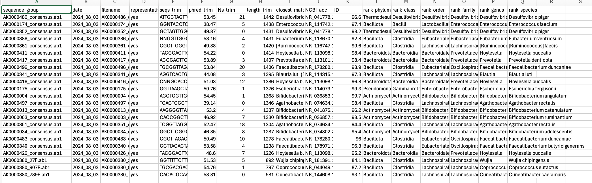

# nf-Sanger

## Acknowledgement

This pipeline is based on the original [ioslateR](https://github.com/bdaisley/isolateR) repo. Modifications have been made to make use of our infrastrucutre more readily. If you're here for details about the pipeline, please consider taking a look at the original repo.


## Sample batch command
====================

### This is a Sanger assembly & annotation pipeline for the Nextflow framework.

#### 1. Only 4 fixed primers which are allowed in the pipeline are "27F", "789F", "907R", "1492R"
#### 2. Sample names are detected automatically. The format of ab1 file name is something like AK0000500_1492R_2024-07-23.ab1 <!--(Only the dash sign (-) is allowed in the assigned sample names)-->
#### 3. Three required parameters are assigned group name, order name by QuintaraBio and order id by QuintaraBio

```{bash}
aws batch submit-job \
  --job-name nf-sanger-954461 \
  --job-queue priority-maf-pipelines \
  --job-definition nextflow-production \
  --container-overrides command="FischbachLab/nf-Sanger \
"--group","20240731_M002-20_16S-Sanger", \
"--name","20240731_M002-20_16S-Sanger", \
"--order","954461", \
"--output_path", "s3://genomics-workflow-core/Results/Sanger/TEST" "
```

### The final Sanger summary file:
```{bash}
s3://genomics-workflow-core/Results/Sanger/TEST/20240731_M002-20_16S-Sanger/Sanger_outputs/03_isoLIB_results.csv
```
- Inspect the summary via CSV or html files



### The sanger assembled sequences:
```{bash}
s3://genomics-workflow-core/Results/Sanger/TEST/20240731_M002-20_16S-Sanger/Sanger_outputs/02_isoTAX_query.fasta
```

<!--aws batch submit-job \
  --job-name nf-sanger \
  --job-queue priority-maf-pipelines \
  --job-definition nextflow-production \
  --container-overrides command="FischbachLab/nf-Sanger, \
"--group","20230309_TYs", \
"--name","20230309_TYs", \
"--order","835278", \
"--output_path", "s3://genomics-workflow-core/Results/Sanger" " -->
<!--s3://genomics-workflow-core/Results/Sanger/20230309_TYs/QB_RAW_DATA_by_group/20230309_TYs/789F_907R_27F_1492R_outputs/sanger_assembly_summary.csv-->
<!--s3://genomics-workflow-core/Results/Sanger/20230309_TYs/QB_RAW_DATA_by_group/20230309_TYs/789F_907R_27F_1492R_outputs/Assemblies/>